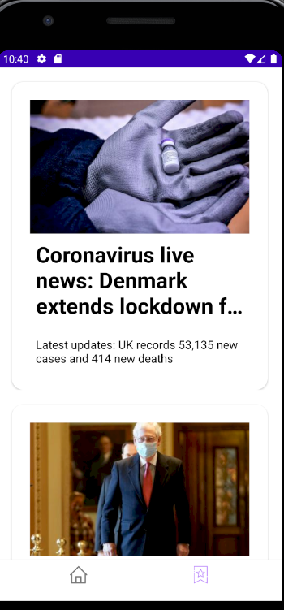

# NewsAppNayla
News App with Guardian API 
- **Kotlin**
- **Android**

# Components

- LiveData
- ViewModel
- Room 

## İf you want to run
- Go to **GuardianAPI** and generate an API key (It's only 2 steps!)
- Put the API key at the Constant.kt newsAPIKey = "YOUR_API_KEY"
- Run the app

## Architecture

# HELP
If you want to help please send me pull requests ,have a nice day :)
